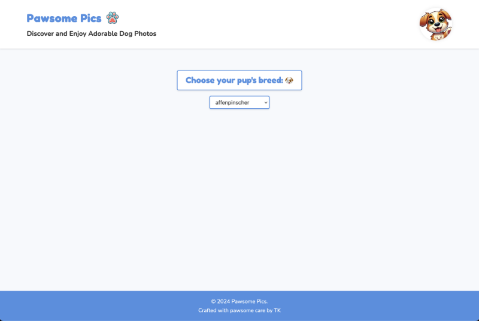
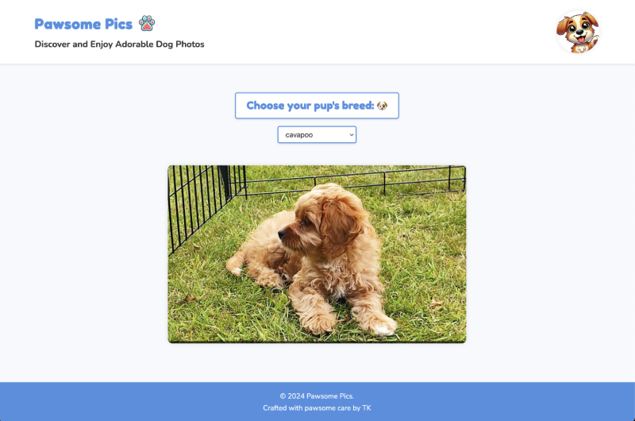
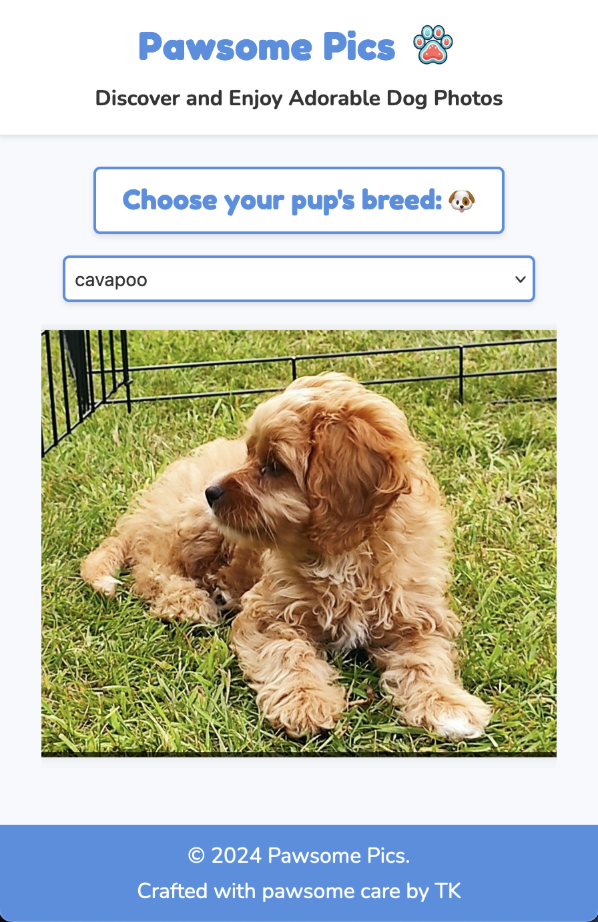

# Pawsome Pics

## Introduction

This project is part of the "Using JavaScript in Websites" course from the Frontend Masters Bootcamp. Initially titled "Dog App Exercise," I renamed it to "Pawsome Pics." This interactive web app allows users to select a breed of dog from a dropdown menu and displays an image of the selected breed. The project is a practical representation of working with APIs, JavaScript, HTML, and CSS.

I put extra effort into the design to give it a unique look and feel. The app is mobile-friendly, which I personally added. The biggest lesson from this project was learning API integration, a key skill covered in this lesson. Creating a loading spinner was also a fun and valuable exercise that I will use throughout my career. The heart-shaped spinner is a unique touch that aligns with the modern, family-friendly vibe of the app. Both logos are original, showcasing my ability to implement cohesive and engaging visual elements.





## Live Site

You can view the live version of the project [here](https://pawsome-pics.netlify.app/).

## Features

- **HTML and CSS**: Structurally sound and visually appealing design with a modern, family-friendly vibe.
- **JavaScript**: Implements functionality to fetch and display dog images based on the selected breed.
- **API Integration**: Utilizes the Dog CEO API to fetch breed lists and images.
- **Loading Spinner**: Displays a heart-shaped loading spinner while fetching images.
- **Responsive Design**: Mobile-friendly layout that adapts to different screen sizes.

## Personal Learnings

While working on this project, I learned and reinforced several important concepts:

- **API Integration**: Gained hands-on experience in fetching data from an API and handling asynchronous operations with promises.
- **JavaScript DOM Manipulation**: Learned how to dynamically update the DOM based on user interactions and API responses.
- **CSS for Modern Design**: Enhanced my skills in CSS to create a cohesive and modern design that is both visually appealing and functional.
- **Responsive Design**: Developed a mobile-friendly layout using media queries to ensure the app works well on different devices.
- **Loading Spinner**: Implemented a custom heart-shaped loading spinner, adding a unique and engaging touch to the app.

## Acknowledgements

This project is part of the Frontend Masters Bootcamp, specifically focusing on HTML, CSS, and JavaScript lessons. Special thanks to the instructors for providing valuable lessons and resources. Learn more at [Frontend Masters Bootcamp](https://frontendmasters.com/bootcamp/) and [Using JavaScript in Websites](https://frontendmasters.com/bootcamp/javascript-in-websites/).

## Getting Started

To get started with this project, clone the repository and open the `index.html` file in your browser.

```sh
git clone https://github.com/tak40/fm-bootcamp-doggos.git
cd fm-bootcamp-doggos
open index.html
```
